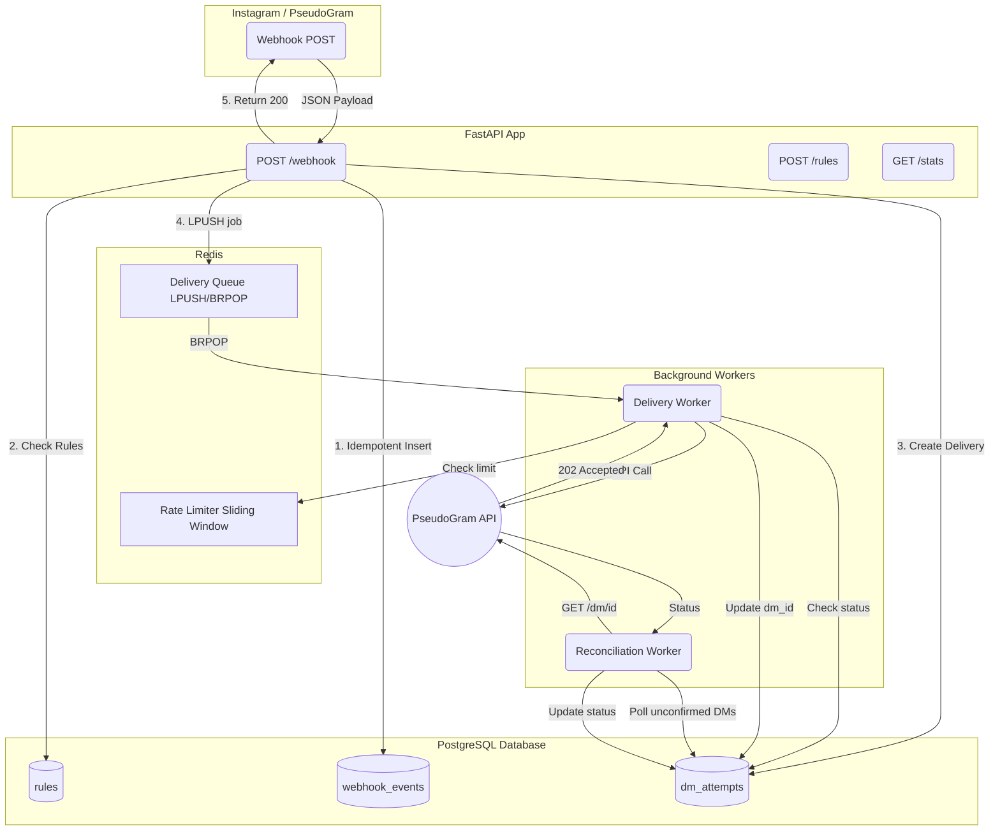

# Architecture

LinkPlease is a distributed, asynchronous system built to handle webhook ingestion, duplicate prevention, and rate-limited external API calls.

## High-Level Diagram

## Component Breakdown

### 1. Webhook Ingestion (FastAPI)
The `POST /webhook` endpoint is designed to be extremely fast. It does not perform any HTTP calls to PseudoGram.
- Validates the HMAC-SHA256 signature in constant time.
- Validates the payload using Pydantic.
- Delegates business logic to the `EventService`.

### 2. Database (PostgreSQL)
The database is the ultimate source of truth for idempotency and state. We do not rely on Redis for critical business invariants.
- `webhook_events`: Enforces `UNIQUE(event_id, event_type)` using `ON CONFLICT DO NOTHING`.
- `dm_attempts`: Enforces `UNIQUE(rule_id, recipient_user_id)`. This guarantees a user never gets the same DM twice.

### 3. Queue and Rate Limiting (Redis)
- **Queue**: A simple `LPUSH` / `BRPOP` list queue. It provides instant notification to workers.
- **Rate Limiter**: A sliding window implemented via a Lua script to ensure atomicity across multiple concurrent workers. It strictly enforces the 10 requests / 60 seconds limit.

### 4. Delivery Worker
A daemon process that reads from the Redis queue.
- Picks up pending `dm_attempts`.
- Transitions state to `sending` to mark it claimed (and provide a crash-recovery checkpoint).
- Respects the Redis rate limiter.
- Calls the PseudoGram API.
- Handles retries on 500, sleeps on 429, and fails permanently on 400.
- Executes a startup scan to recover any jobs that were stuck in `sending` during a previous crash.

### 5. Reconciliation Worker
A periodic background task.
- Queries the database for all `dm_attempts` that are in the `sent` (202 Accepted) state but have not been fully confirmed.
- Polls the PseudoGram API to get the final status (`delivered` or `failed`).
- Ensures stats are accurate and handles the 15% silent failure rate of the mock API.
